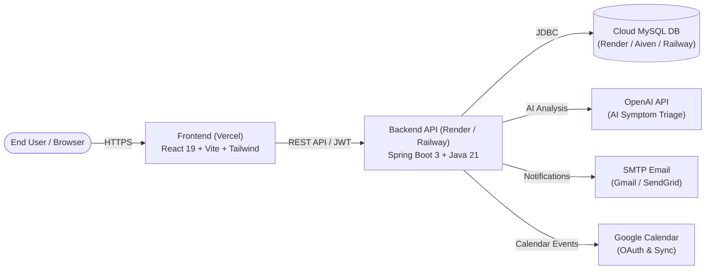

# Production Deployment & Real-World Operations Guide

This guide walks you through connecting your **live Vercel frontend** to a **cloud-hosted Spring Boot backend** and **cloud MySQL database** for actual real-world use.

---

## 📐 Production Architecture Overview

---

## 🚀 Step 1: Deploy Backend & Database (Choose One Platform)

### Option A: Render (Recommended — Easiest Pairing with Vercel)

Render can build the Dockerfile directly from your GitHub repository.

1. **Sign in to Render**: Go to [render.com](https://render.com) and log in with your GitHub account.
2. **Create MySQL Database**:
   - In Render Dashboard, click **New +** ➔ **MySQL** (or use a free managed MySQL from [Aiven.io](https://aiven.io) or [PlanetScale](https://planetscale.com)).
   - Note down:
     - `DB_URL` (e.g. `jdbc:mysql://<host>:<port>/<dbname>?useSSL=true&allowPublicKeyRetrieval=true`)
     - `DB_USERNAME`
     - `DB_PASSWORD`
3. **Create Web Service**:
   - Click **New +** ➔ **Web Service**.
   - Select your repository: `healthcare-appointment-manager`.
   - Configure:
     - **Runtime**: `Docker`
     - **Dockerfile Path**: `./backend/Dockerfile`
     - **Docker Context**: `./backend`
     - **Instance Type**: `Free` or `Starter`
   - **Environment Variables**:
     | Variable | Recommended Value |
     | :--- | :--- |
     | `SPRING_PROFILES_ACTIVE` | `prod` |
     | `DB_URL` | `jdbc:mysql://<host>:<port>/<dbname>?useSSL=true&allowPublicKeyRetrieval=true` |
     | `DB_USERNAME` | `<your-db-user>` |
     | `DB_PASSWORD` | `<your-db-password>` |
     | `JWT_SECRET` | *Click generate or enter a 64+ char random string* |
     | `ALLOWED_ORIGINS` | `https://*.vercel.app,https://your-domain.com,http://localhost:5173` |
     | `OPENAI_API_KEY` | `sk-...` *(Your OpenAI API Key)* |
     | `MAIL_HOST` | `smtp.gmail.com` |
     | `MAIL_PORT` | `587` |
     | `MAIL_USERNAME` | `your-email@gmail.com` |
     | `MAIL_PASSWORD` | `your-16-char-gmail-app-password` |
     | `MAIL_FROM` | `your-email@gmail.com` |

4. Click **Create Web Service**. Once deployed, Render will provide a public URL like:
   `https://healthcare-appointment-backend.onrender.com`

---

### Option B: Railway

1. Go to [railway.app](https://railway.app) and connect your GitHub repo.
2. Click **Add Plugin / Service** ➔ **MySQL**.
3. Add a service from GitHub repo ➔ Set Dockerfile to `backend/Dockerfile`.
4. Connect the database variables (`MYSQL_URL` automatically mapped to `DATABASE_URL` or `DB_URL`).
5. Add the environment variables listed above.

---

## 🌐 Step 2: Link Your Vercel Frontend to Backend

Now connect your live Vercel frontend to the cloud backend API.

1. Go to your **[Vercel Dashboard](https://vercel.com/dashboard)**.
2. Select your `healthcare-appointment-manager` project.
3. Go to **Settings** ➔ **Environment Variables**.
4. Add a new variable:
   - **Key**: `VITE_API_URL`
   - **Value**: `https://<your-backend-app-url>/api` *(e.g. `https://healthcare-appointment-backend.onrender.com/api`)*
   - **Environments**: Check `Production`, `Preview`, and `Development`.
5. Go to **Deployments** tab ➔ Click **•••** on the latest deployment ➔ **Redeploy**.

---

## 🔑 Step 3: Production Integrations Setup

### 1. OpenAI API Key (AI Symptom Triage)
- Generate a key at [platform.openai.com/api-keys](https://platform.openai.com/api-keys).
- Set `OPENAI_API_KEY=sk-...` in your backend environment variables.
- Default model used: `gpt-4o`.

### 2. Gmail SMTP Notifications (Real Emails)
- Go to [Google Account Security](https://myaccount.google.com/security).
- Enable **2-Step Verification**.
- Under 2-Step Verification, navigate to **App Passwords**.
- Create an App Password for "Mail" / "Healthcare App".
- Set:
  - `MAIL_USERNAME=your.email@gmail.com`
  - `MAIL_PASSWORD=xxxx xxxx xxxx xxxx` (16-character app password without spaces)

### 3. Google Calendar OAuth (Optional)
- Create a project in [Google Cloud Console](https://console.cloud.google.com/).
- Enable **Google Calendar API**.
- Create **OAuth 2.0 Client IDs** (Web application).
- Set Authorized Redirect URI: `https://<your-backend-domain>/api/calendar/callback`.
- Configure `GOOGLE_CLIENT_ID` and `GOOGLE_CLIENT_SECRET`.

---

## 🛡️ Default Production Credentials (Initial Seed)

When the backend starts with an empty database, Flyway executes the migrations and `DataInitializer` seeds standard administrative accounts:

| Role | Email | Password | Description |
| :--- | :--- | :--- | :--- |
| **Admin** | `admin@healthcare.com` | `Admin@123456` | Full platform administration |
| **Doctor** | `dr.jenkins@healthcare.com` | `Doctor@123456` | Cardiology specialist |
| **Doctor** | `dr.chen@healthcare.com` | `Doctor@123456` | Dermatology specialist |
| **Doctor** | `dr.rodriguez@healthcare.com` | `Doctor@123456` | Pediatrics specialist |
| **Doctor** | `dr.patel@healthcare.com` | `Doctor@123456` | Neurology specialist |

> [!CAUTION]
> In an enterprise real-world production rollout, log in as `admin@healthcare.com` and immediately update all default passwords or register individual doctor accounts.

---

## 🧪 Production Verification Checklist

1. [ ] **Health Endpoint**: Open `https://<your-backend-domain>/actuator/health` in your browser. It should return `{"status":"UP"}`.
2. [ ] **Swagger UI**: Open `https://<your-backend-domain>/swagger-ui.html` to inspect live interactive API documentation.
3. [ ] **Frontend Login**: Open your Vercel URL, click **Login**, enter `admin@healthcare.com` / `Admin@123456`.
4. [ ] **Patient Registration**: Test registering a new patient with a real email.
5. [ ] **AI Symptom Checker**: Book an appointment, input symptoms (e.g. *"Chest pain and shortness of breath"*), and verify the AI triage analysis recommending Cardiology.
6. [ ] **Email Delivery**: Verify receiving the automated HTML confirmation email.
