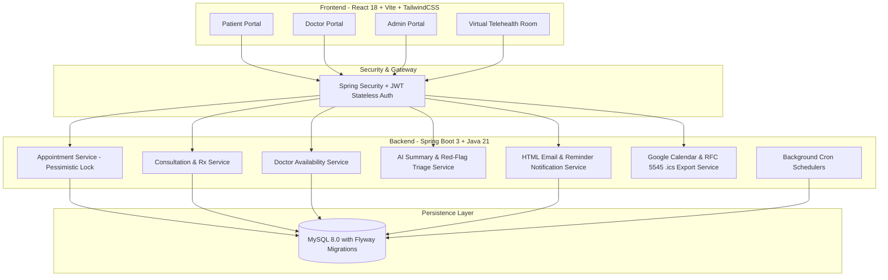

# 🏥 Healthcare Appointment & Follow-up Manager

[](https://github.com/Anshrstg43/healthcare-appointment-manager/actions/workflows/ci.yml)
[](https://www.oracle.com/java/)
[](https://spring.io/projects/spring-boot)
[](https://reactjs.org/)
[](https://www.typescriptlang.org/)
[](LICENSE)

An enterprise-grade, full-stack, AI-assisted healthcare appointment management and clinical follow-up platform connecting **Patients**, **Doctors**, and **Clinic Administrators**.

---

## 📑 Table of Contents
1. [Architecture Overview](#-architecture-overview)
2. [Database Schema & Entity Relationship](#-database-schema--entity-relationship)
3. [Key Persona Features](#-key-persona-features)
4. [LLM Prompts & AI Integration](#-llm-prompts--ai-integration)
5. [Double-Booking Prevention (Pessimistic Locking)](#-double-booking-prevention-pessimistic-locking)
6. [Google Calendar & .ics Export Setup](#-google-calendar--ics-export-setup)
7. [System Design Highlights](#-system-design-highlights)
8. [Pre-Seeded Demo Credentials](#-pre-seeded-demo-credentials)
9. [Quick Start & Running Locally](#-quick-start--running-locally)
10. [Docker Compose Deployment](#-docker-compose-deployment)
11. [REST API Documentation](#-rest-api-documentation)
12. [Automated Testing & CI/CD](#-automated-testing--cicd)

---

## 🏛️ Architecture Overview



---

## 🗄️ Database Schema & Entity Relationship

Managed automatically via Flyway database migrations (`V1__initial_schema.sql`):

```mermaid
erDiagram
    USERS ||--o| PATIENTS : "has profile"
    USERS ||--o| DOCTORS : "has profile"
    DOCTORS ||--o{ DOCTOR_LEAVES : "has leaves"
    DOCTORS ||--o{ APPOINTMENTS : "conducts"
    PATIENTS ||--o{ APPOINTMENTS : "books"
    APPOINTMENTS ||--o| PRESCRIPTIONS : "contains"
    PRESCRIPTIONS ||--o{ PRESCRIPTION_ITEMS : "has medicines"
    APPOINTMENTS ||--o{ AI_SUMMARIES : "has pre/post summaries"
    PATIENTS ||--o{ MEDICATION_REMINDERS : "receives"
    USERS ||--o{ NOTIFICATIONS : "receives"

    USERS {
        bigint id PK
        varchar name
        varchar email UK
        varchar password_hash
        varchar role "PATIENT | DOCTOR | ADMIN"
        boolean active
    }

    DOCTORS {
        bigint id PK
        bigint user_id FK
        varchar specialization
        json working_schedule
        int slot_duration_minutes
        boolean active
    }

    APPOINTMENTS {
        bigint id PK
        bigint patient_id FK
        bigint doctor_id FK
        date appointment_date
        time start_time
        time end_time
        varchar status "HELD | CONFIRMED | COMPLETED | CANCELLED"
        text symptoms_text
        text clinical_notes
        timestamp hold_expires_at
    }
```



---

## 🤖 LLM Prompts & AI Integration

The platform leverages OpenAI GPT-4o with graceful heuristic fallback when unconfigured.

### 1. Pre-Visit Intake & Triage Prompt
```text
You are a clinical AI triage assistant.
Analyze these symptoms and return:
1. Urgency level: LOW, MEDIUM, or HIGH (set to HIGH if acute chest pain, dyspnea, stroke signs, or severe distress are present)
2. Chief complaint (concise 3-5 word summary)
3. Three suggested diagnostic questions for the examining doctor.

Symptoms: <symptoms>
```

### 2. Post-Visit Patient Guidance Prompt
```text
You are a patient communication specialist.
Convert these clinical notes and prescribed medications into a clear, patient-friendly summary (6th-grade reading level) with:
1. Overview of diagnosis and findings
2. Clear daily medication schedule with instructions
3. Warning signs and when to seek immediate medical attention
4. Follow-up instructions

Clinical Notes: <notes>
Prescription Details: <prescriptions>
```

---

## 🔒 Double-Booking Prevention (Pessimistic Locking)

To prevent simultaneous double-booking of the same doctor slot under concurrent traffic, `AppointmentRepository` acquires row-level write locks:

```java
@Lock(LockModeType.PESSIMISTIC_WRITE)
@Query("SELECT a FROM Appointment a WHERE a.doctor.id = :doctorId " +
       "AND a.appointmentDate = :date AND a.startTime = :startTime " +
       "AND a.status IN ('HELD', 'CONFIRMED')")
List<Appointment> findActiveOverlappingAppointmentsForUpdate(
    @Param("doctorId") Long doctorId,
    @Param("date") LocalDate date,
    @Param("startTime") LocalTime startTime
);
```

If another transaction attempts to hold or book the same slot, it is blocked until the first commits, and is subsequently rejected with HTTP `409 Conflict` (`SLOT_UNAVAILABLE`).

---

## 📅 Google Calendar & .ics Export Setup

### 1. Google Calendar OAuth 2.0 Integration
1. Create a project in [Google Cloud Console](https://console.cloud.google.com/).
2. Enable **Google Calendar API**.
3. Create an **OAuth 2.0 Client ID** (Web application).
4. Set Authorized Redirect URI to `http://localhost:8080/api/calendar/callback`.
5. Populate `GOOGLE_CLIENT_ID` and `GOOGLE_CLIENT_SECRET` in `.env`.
6. When an appointment is booked, rescheduled, or cancelled, Google Calendar events are automatically synced in both patient and doctor calendars.

### 2. Universal RFC 5545 `.ics` Export (No API Keys Required)
* A compliant `.ics` calendar invitation file is downloadable via `GET /api/calendar/export/{appointmentId}`.
* Supported out-of-the-box on Apple Calendar, Outlook, and mobile calendar apps with 30-minute reminder alarms.

---

## 📐 System Design Highlights

A comprehensive 800-word system design write-up is available in **[SYSTEM_DESIGN.md](SYSTEM_DESIGN.md)** covering:
1. **Double-booking prevention:** Row-level pessimistic write locking + transaction isolation.
2. **Doctor leave conflict handling:** Atomic cascading cancellations, patient email dispatch, and Google Calendar event deletion.
3. **Slot hold mechanism:** 15-minute lease with automated background expiration cron.
4. **Notification failure handling:** Outbox queue with exponential retry backoff.

---

## 🔑 Pre-Seeded Demo Credentials

| Role | Email | Password | Pre-configured Data |
|---|---|---|---|
| **Patient** | `patient@healthcare.com` | `Patient@123456` | Active bookings, AI triage pre-visit summary, medication schedule |
| **Doctor** | `dr.jenkins@healthcare.com` | `Doctor@123456` | Cardiology specialist, consultation queue, clinical notes |
| **Doctor** | `dr.chen@healthcare.com` | `Doctor@123456` | Dermatology specialist |
| **Admin** | `admin@healthcare.com` | `Admin@123456` | Full clinic administration access & metrics |

---

## 🚀 Quick Start & Running Locally

### Prerequisites
* **Java 21 LTS**
* **Node.js 18+** & **npm**
* **MySQL 8.0** running locally on port `3306` (Database: `healthcare_db`, User: `root`, Password: `root`)

### One-Command Runner
```bash
./run.sh
```
* Backend API runs on `http://localhost:8080` (Swagger UI: `http://localhost:8080/swagger-ui.html`)
* Frontend runs on `http://localhost:5173`

---

## 🐳 Docker Compose Deployment

Run the complete full-stack environment (MySQL 8.0 + Spring Boot 3 + React/Nginx) in a single command:

```bash
docker compose up --build
```
* Web Application: `http://localhost` or `http://localhost:5173`
* Backend API: `http://localhost:8080`

---

## 📡 REST API Documentation

### Authentication
* `POST /api/auth/register` — Register a new patient account.
* `POST /api/auth/login` — Authenticate and receive JWT access token.

### Doctors & Availability
* `GET /api/doctors` — Search active doctors with filters (specialty, name).
* `GET /api/doctors/{id}` — Get doctor clinical profile.
* `GET /api/doctors/{id}/availability?date=YYYY-MM-DD` — Calculate real-time available time slots.

### Appointments
* `POST /api/appointments` — Book an appointment with pessimistic double-booking protection.
* `GET /api/appointments` — List appointments for current patient.
* `GET /api/appointments/{id}` — Get appointment details with AI summaries & prescriptions.
* `PUT /api/appointments/{id}/reschedule` — Reschedule appointment date/time.
* `PUT /api/appointments/{id}/cancel` — Cancel appointment.
* `GET /api/calendar/export/{id}` — Export RFC 5545 `.ics` calendar invitation file.

### Doctor Consultations
* `GET /api/doctor/appointments` — Doctor appointment queue with status filters.
* `POST /api/doctor/consultations/{id}/notes` — Save clinical notes.
* `POST /api/doctor/consultations/{id}/prescription` — Prescribe medication regimen.
* `PUT /api/doctor/consultations/{id}/complete` — Complete consultation & trigger AI post-visit summary.

### Admin Operations
* `GET /api/admin/stats` — High-level clinic KPI metrics.
* `POST /api/admin/doctors` — Onboard new doctor.
* `PUT /api/admin/doctors/{id}` — Update doctor profile & weekly schedule.
* `POST /api/admin/doctors/{id}/leave` — Mark doctor leave date & cascade cancel conflicting appointments.

---

## 🧪 Automated Testing & CI/CD

Run the automated backend test suite:

```bash
cd backend
mvn clean test
```

### GitHub Actions CI Workflow
Every push to `main` triggers automated validation in [.github/workflows/ci.yml](.github/workflows/ci.yml):
* ✅ `mvn clean test` (Spring Boot unit & service test suites).
* ✅ `npm run build` (TypeScript compilation & Vite bundle build).

---

## 📄 License
This project is open-source and available under the [MIT License](LICENSE).
