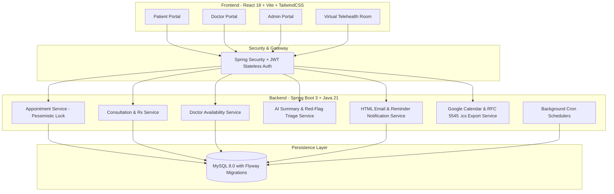
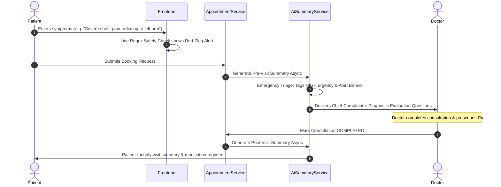

# 🏥 Healthcare Appointment & Follow-up Manager

[](https://github.com/Anshrstg43/healthcare-appointment-manager/actions/workflows/ci.yml)
[](https://www.oracle.com/java/)
[](https://spring.io/projects/spring-boot)
[](https://reactjs.org/)
[](https://www.typescriptlang.org/)
[](LICENSE)

An enterprise-grade, full-stack, AI-assisted healthcare appointment management and clinical follow-up platform connecting **Patients**, **Doctors**, and **Clinic Administrators**.

---

## 📑 Table of Contents
1. [Architecture Overview](#-architecture-overview)
2. [Key Persona Features](#-key-persona-features)
3. [AI Engine & Red-Flag Emergency Triage](#-ai-engine--red-flag-emergency-triage)
4. [Double-Booking Prevention (Pessimistic Locking)](#-double-booking-prevention-pessimistic-locking)
5. [Calendar Synchronization & .ics Export](#-calendar-synchronization--ics-export)
6. [Pre-Seeded Demo Credentials](#-pre-seeded-demo-credentials)
7. [Quick Start & Running Locally](#-quick-start--running-locally)
8. [Docker Compose Deployment](#-docker-compose-deployment)
9. [REST API Documentation](#-rest-api-documentation)
10. [Automated Testing & CI/CD](#-automated-testing--cicd)

---

## 🏛️ Architecture Overview



---

## 🌟 Key Persona Features

### 👤 1. Patient Portal
* **Live Slot Picker:** Dynamic real-time slot generation considering doctor working hours, 15–60 min slot durations, blackout leaves, and active bookings.
* **Red-Flag Emergency Warning:** Live symptom scanner that triggers high-urgency alerts and advises immediate 911/emergency care when red-flag keywords are entered.
* **Pre-Visit AI Summary:** Automatically categorizes chief complaint, urgency level (`LOW`, `MEDIUM`, `HIGH`), and prepares tailored diagnostic questions for the doctor.
* **Universal Calendar Integration:** One-click Google Calendar sync and standard RFC 5545 `.ics` download for Apple Calendar, Outlook, and offline calendars.
* **Daily Medication Checklist:** Adherence tracker displaying morning, afternoon, and night doses with completion tracking.
* **Virtual Telehealth Consultation:** In-browser consultation room with simulated HD video, mic/camera toggles, and live clinical chat.
* **Medical Profile & Printable Prescriptions:** Blood group, allergies, chronic conditions manager + printable clinic prescription view with digital signature badge.

### 🩺 2. Doctor Portal
* **Clinical Agenda:** Real-time today's appointment queue and upcoming schedules.
* **Intake Briefing:** Instant access to patient's chief complaint, AI pre-visit questions, and urgency badge prior to consultation.
* **Clinical Notes & Prescription Builder:** Record objective medical notes and prescribe medications with 1-click presets (Amoxicillin, Paracetamol, Cetirizine, Omeprazole, Metformin).
* **AI Post-Visit Summary:** Automatically translates clinical notes and prescription regimens into plain, patient-friendly guidance and clear medication schedules.
* **Clinical Analytics:** Weekly patient load bar chart and consultation status distribution donut chart.

### 🛡️ 3. Clinic Admin Portal
* **Operational KPI Dashboard:** High-level metrics for registered patients, active doctors, today's appointments, upcoming bookings, and cancellations.
* **Doctor Roster Management:** Onboard doctors, customize slot durations (15/20/30/45/60 min), toggle active status, and configure day-by-day start/end working hours.
* **Doctor Leave Engine:** Set leave dates with automatic cascade cancellations of conflicting bookings, automated patient email notifications, and calendar sync updates.
* **Visual Intelligence:** Interactive weekly booking trend bar charts and specialty distribution donut charts.

---

## 🚨 AI Engine & Red-Flag Emergency Triage



---

## 🔒 Double-Booking Prevention (Pessimistic Locking)

To prevent simultaneous double-booking of the same slot under high concurrent traffic, `AppointmentRepository` enforces database-level row write locks:

```java
@Lock(LockModeType.PESSIMISTIC_WRITE)
@Query("SELECT a FROM Appointment a WHERE a.doctor.id = :doctorId " +
       "AND a.appointmentDate = :date AND a.startTime = :startTime " +
       "AND a.status IN ('HELD', 'CONFIRMED')")
List<Appointment> findActiveOverlappingAppointmentsForUpdate(
    @Param("doctorId") Long doctorId,
    @Param("date") LocalDate date,
    @Param("startTime") LocalTime startTime
);
```

If a slot is already held or confirmed by another transaction, the second transaction is immediately rejected with a `409 Conflict` error (`SLOT_UNAVAILABLE`).

---

## 🔑 Pre-Seeded Demo Credentials

| Role | Email | Password | Pre-configured Data |
|---|---|---|---|
| **Patient** | `patient@healthcare.com` | `Patient@123456` | Active bookings, pre-visit summary, medication schedule |
| **Doctor** | `dr.jenkins@healthcare.com` | `Doctor@123456` | Cardiology specialist, consultation queue, clinical notes |
| **Doctor** | `dr.chen@healthcare.com` | `Doctor@123456` | Dermatology specialist |
| **Admin** | `admin@healthcare.com` | `Admin@123456` | Full clinic administration access & metrics |

---

## 🚀 Quick Start & Running Locally

### Prerequisites
* **Java 21 LTS**
* **Node.js 18+** & **npm**
* **MySQL 8.0** running locally on port `3306` (Database: `healthcare_db`, User: `root`, Password: `root`)

### One-Command Runner
Execute the included root script to automatically build and launch both Backend (`:8080`) and Frontend (`:5173`):
```bash
./run.sh
```

### Manual Launch

#### 1. Backend (Spring Boot 3)
```bash
cd backend
mvn clean spring-boot:run
```
*API runs on `http://localhost:8080` (Swagger UI: `http://localhost:8080/swagger-ui.html`)*

#### 2. Frontend (React + Vite)
```bash
cd frontend
npm install
npm run dev
```
*Application runs on `http://localhost:5173`*

---

## 🐳 Docker Compose Deployment

Run the complete full-stack environment (MySQL 8.0 + Spring Boot 3 + React/Nginx) in a single command:

```bash
docker compose up --build
```
* Access the web application at `http://localhost` or `http://localhost:5173`.
* Access the backend REST API at `http://localhost:8080`.

---

## 📡 REST API Documentation

### Authentication
* `POST /api/auth/register` — Register a new patient account.
* `POST /api/auth/login` — Authenticate and receive JWT access token.

### Doctors & Availability
* `GET /api/doctors` — Search active doctors with filters (specialty, name).
* `GET /api/doctors/{id}` — Get doctor clinical profile.
* `GET /api/doctors/{id}/availability?date=YYYY-MM-DD` — Calculate real-time available time slots.

### Appointments
* `POST /api/appointments` — Book an appointment with pessimistic double-booking protection.
* `GET /api/appointments` — List appointments for current patient.
* `GET /api/appointments/{id}` — Get appointment details with AI summaries & prescriptions.
* `PUT /api/appointments/{id}/reschedule` — Reschedule appointment date/time.
* `PUT /api/appointments/{id}/cancel` — Cancel appointment.
* `GET /api/calendar/export/{id}` — Export RFC 5545 `.ics` calendar invitation file.

### Doctor Consultations
* `GET /api/doctor/appointments` — Doctor appointment queue with status filters.
* `POST /api/doctor/consultations/{id}/notes` — Save clinical notes.
* `POST /api/doctor/consultations/{id}/prescription` — Prescribe medication regimen.
* `PUT /api/doctor/consultations/{id}/complete` — Complete consultation & trigger AI post-visit summary.

### Admin Operations
* `GET /api/admin/stats` — High-level clinic KPI metrics.
* `POST /api/admin/doctors` — Onboard new doctor.
* `PUT /api/admin/doctors/{id}` — Update doctor profile & weekly schedule.
* `POST /api/admin/doctors/{id}/leave` — Mark doctor leave date & cascade cancel conflicting appointments.

---

## 🧪 Automated Testing & CI/CD

Run the automated backend test suite (covering availability slot calculations, double booking locks, leave cascade cancellations, and prescription reminders):

```bash
cd backend
mvn clean test
```

### GitHub Actions CI Workflow
Every push to `main` triggers automated validation in [.github/workflows/ci.yml](.github/workflows/ci.yml):
* ✅ `mvn clean test` (Spring Boot unit & service test suites).
* ✅ `npm run build` (TypeScript compilation & Vite bundle build).

---

## 📄 License
This project is open-source and available under the [MIT License](LICENSE).
